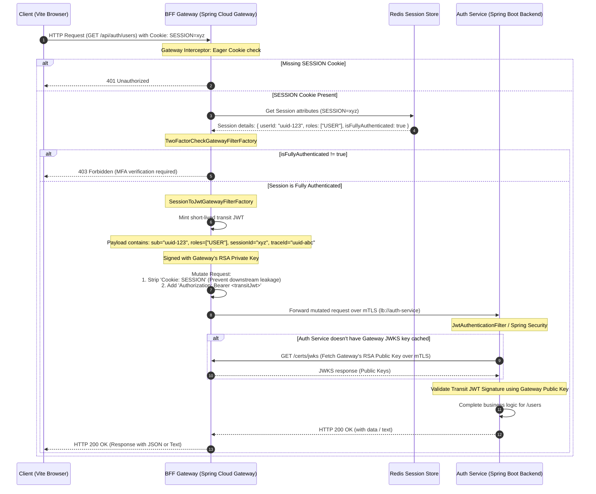
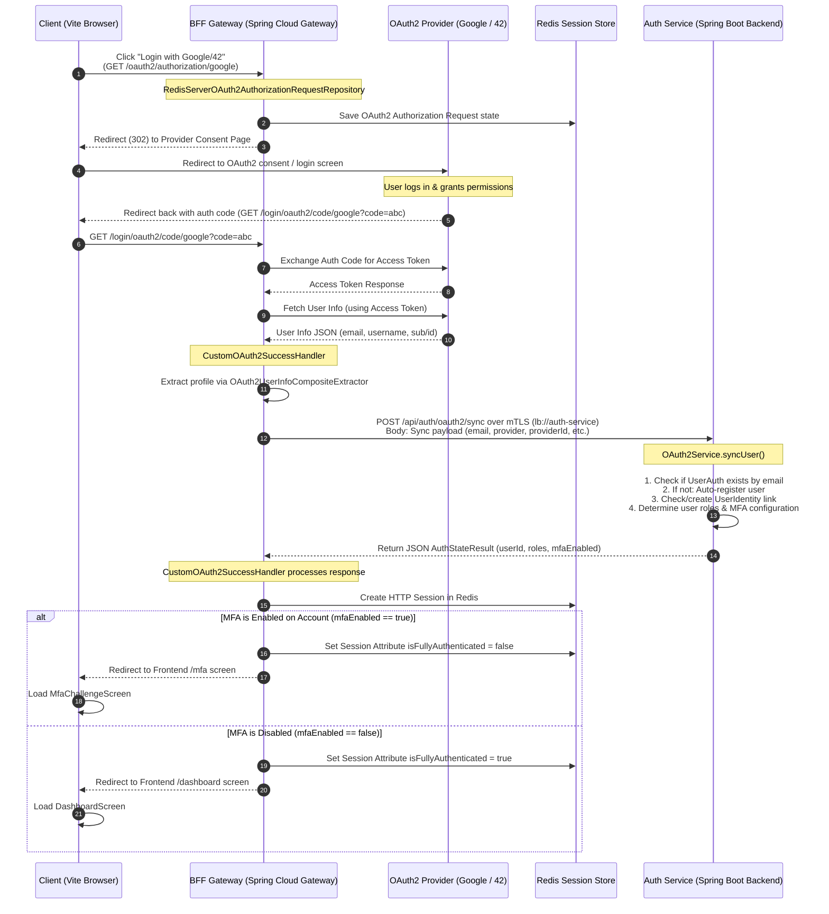
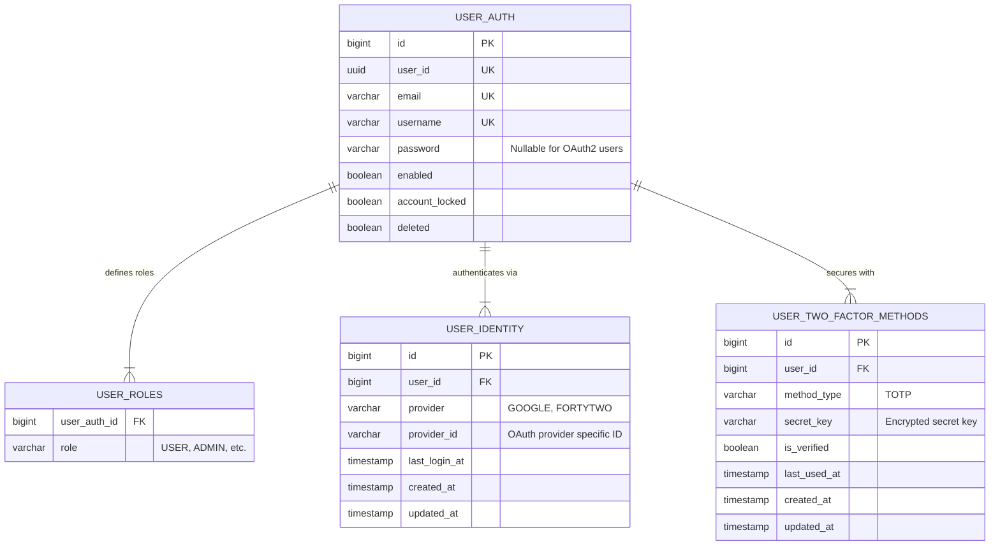
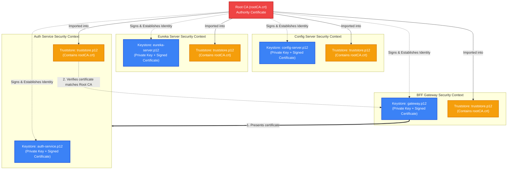

# 🌐 Transcendence Microservices - Architecture & Developer Guide

Welcome to the architectural documentation for the Transcendence Microservices ecosystem. This guide provides a detailed look at the network layout, security models, database schemas, and protocols that govern communications within our microservices network.

---

## 🏛️ System Architecture

Our project follows the **Backend-For-Frontend (BFF)** pattern. The Frontend client communicates solely with a single exposed entrypoint (the Gateway), while all internal communication between core services is restricted, discovery-driven, and secured via mutual TLS (mTLS).

```mermaid
flowchart TB
    %% Nodes styling
    classDef client fill:#3b82f6,stroke:#1d4ed8,stroke-width:2px,color:#fff;
    classDef public fill:#ef4444,stroke:#b91c1c,stroke-width:2px,color:#fff;
    classDef internal fill:#10b981,stroke:#047857,stroke-width:2px,color:#fff;
    classDef db fill:#f59e0b,stroke:#d97706,stroke-width:2px,color:#fff;
    classDef infra fill:#6b7280,stroke:#374151,stroke-width:2px,color:#fff;

    subgraph External_Network ["External Clients"]
        Browser["React/Vite Frontend App<br>(Browser)"]:::client
    end

    subgraph Host_Machine ["Host Machine (Local Dev / Docker Bridge)"]
        subgraph Exposed_Ports ["Port Mappings to Host"]
            GatewayPort["Gateway Port<br>:8080 (HTTPS)"]:::public
            DbPort["Postgres Port<br>:5432 (TCP)"]:::infra
            RedisPort["Redis Port<br>:6379 (TCP)"]:::infra
            RedisCommanderPort["Redis Commander Port<br>:6381 (HTTP)"]:::infra
            RabbitPort["RabbitMQ AMQP/UI Ports<br>:5672 / :15672"]:::infra
        end

        subgraph transcendence_net ["transcendence-net (Docker Bridge Network)"]
            %% Public Entrypoint
            Gateway["Gateway Service (BFF)<br>Spring Cloud Gateway<br>(https://gateway:8080)"]:::public

            %% Internal Microservices
            AuthService["Auth Service<br>Spring Boot / Security<br>(https://auth-service:8081)"]:::internal
            EurekaServer["Eureka Registry Server<br>Spring Cloud Eureka<br>(https://eureka-server:8761)"]:::internal
            ConfigServer["Config Server<br>Spring Cloud Config<br>(https://config-server:8888)"]:::internal

            %% Infrastructure & Databases
            Postgres["PostgreSQL Database<br>(postgres-db:5432)"]:::db
            Redis["Redis Cache & Session Store<br>(redis-container:6379)"]:::db
            RabbitMQ["RabbitMQ Broker<br>(rabbitmq:5672)"]:::db
            RedisCommander["Redis Commander (Admin GUI)<br>(redis-commander:8081)"]:::infra
        end
        
        ConfigRepo["Local Config Repo<br>(./config-repo)"]:::infra
    end

    %% Communication Links
    Browser -->|HTTPS / WSS| GatewayPort
    GatewayPort --> Gateway

    %% Config server loading
    ConfigServer -.->|Reads YAML Config| ConfigRepo
    
    %% Service Discovery Registration
    Gateway -.->|Register / Locate| EurekaServer
    AuthService -.->|Register / Locate| EurekaServer

    %% Config retrieval (mTLS)
    Gateway ==>|mTLS / HTTPS| ConfigServer
    AuthService ==>|mTLS / HTTPS| ConfigServer
    EurekaServer ==>|mTLS / HTTPS| ConfigServer

    %% Downstream Service Calls (mTLS)
    Gateway ==>|mTLS / HTTPS (lb://auth-service)| AuthService

    %% Database & Cache Connections
    Gateway -->|Redis Sessions & OAuth State| Redis
    AuthService -->|User Credentials & DB| Postgres
    AuthService -->|Redis Sessions| Redis
    RedisCommander -->|Admin GUI Monitoring| Redis
    
    %% Port exposures
    Postgres -.-> DbPort
    Redis -.-> RedisPort
    RedisCommander -.-> RedisCommanderPort
    RabbitMQ -.-> RabbitPort

    %% Legend
    style External_Network fill:#e0f2fe,stroke:#0284c7,stroke-width:2px;
    style Host_Machine fill:#f8fafc,stroke:#64748b,stroke-width:2px;
    style transcendence_net fill:#f1f5f9,stroke:#475569,stroke-width:2px,stroke-dasharray: 5 5;
```

> [!NOTE]
> The source file for the system architecture diagram is available in [system_architecture.mermaid](file:///home/yjazouli/1337/Microservices/docs/system_architecture.mermaid).

---

## 🔒 Request Authentication & Gateway-to-Backend Translation

To secure downstream microservices, the BFF Gateway translates stateful browser sessions into stateless JSON Web Tokens (JWTs). Downstream microservices only accept requests signed with the Gateway's private key.

### Authentication Translation Lifecycle:
1. **Session Cookie Propagation**: The Vite client ([api.js](file:///home/yjazouli/1337/Microservices/frontend/src/services/api.js)) initiates requests specifying `credentials: "include"`.
2. **Session Verification**: The Gateway intercepts the request and queries Redis to extract the user's `userId`, `roles`, and `isFullyAuthenticated` attributes.
3. **MFA Check**: [TwoFactorCheckGatewayFilterFactory](file:///home/yjazouli/1337/Microservices/gateway/src/main/java/com/ft_transcendence/gateway/core/filter/TwoFactorCheckGatewayFilterFactory.java) blocks users whose session attribute `isFullyAuthenticated` is `false` (demanding completion of the MFA challenge).
4. **Transit JWT Minting**: [SessionToJwtGatewayFilterFactory](file:///home/yjazouli/1337/Microservices/gateway/src/main/java/com/ft_transcendence/gateway/core/filter/SessionToJwtGatewayFilterFactory.java) generates a short-lived JWT containing the user metadata and signs it with the Gateway's RSA private key.
5. **Cookie Stripping**: The Gateway strips the `Cookie: SESSION` header from the request to prevent token/session hijacking downstream.
6. **Authorization Header Inject**: The Gateway injects the `Authorization: Bearer <transitJwt>` header.
7. **Downstream Execution**: The request is routed via service discovery to the target microservice over mTLS. The target microservice validates the signature of the transit JWT against the Gateway's JWKS public endpoint.



> [!NOTE]
> The source file for the security and auth flow sequence diagram is available in [security_and_auth_flow.mermaid](file:///home/yjazouli/1337/Microservices/docs/security_and_auth_flow.mermaid).

---

## 🔑 OAuth2 Authentication & Account Synchronization Flow

The Gateway hosts OAuth2 Client configurations. When a user authenticates via third-party providers (Google / 42), the Gateway manages authorization code exchange, queries the provider for user profiles, and propagates a synchronization payload down to `auth-service` to reconcile identity details.

### Synchronization Logic:
1. The user logs in via the provider (e.g. Google).
2. The Gateway's [CustomOAuth2SuccessHandler](file:///home/yjazouli/1337/Microservices/gateway/src/main/java/com/ft_transcendence/gateway/security/oauth2/CustomOAuth2SuccessHandler.java) intercepts success, extracts profile attributes, and makes a secure, backend-to-backend mTLS call to [OAuth2Controller](file:///home/yjazouli/1337/Microservices/auth-service/src/main/java/com/ft_transcendence/auth/domain/controller/OAuth2Controller.java)'s `/api/auth/oauth2/sync` endpoint.
3. [OAuth2Service](file:///home/yjazouli/1337/Microservices/auth-service/src/main/java/com/ft_transcendence/auth/domain/service/OAuth2Service.java) reconciles the account in Postgres: registers user if non-existent, links the provider details, and returns user roles and MFA activation state.
4. The Gateway updates the session state in Redis: if MFA is enabled, `isFullyAuthenticated` is set to `false`, and the user is redirected to the `/mfa` challenge screen on the React frontend. Otherwise, they are redirected to `/dashboard`.



> [!NOTE]
> The source file for the OAuth2 sync flow is available in [oauth2_sync_flow.mermaid](file:///home/yjazouli/1337/Microservices/docs/oauth2_sync_flow.mermaid).

---

## 🗄️ Database Entity Relationship Diagram (ERD)

All user accounts, roles, linked identities, and multi-factor credentials are persisted in the PostgreSQL database schema managed by `auth-service`.

- [UserAuth.java](file:///home/yjazouli/1337/Microservices/auth-service/src/main/java/com/ft_transcendence/auth/domain/model/UserAuth.java) stores user authentication details.
- [UserIdentity.java](file:///home/yjazouli/1337/Microservices/auth-service/src/main/java/com/ft_transcendence/auth/domain/model/UserIdentity.java) represents third-party linked social accounts (Google/42).
- [UserTwoFactorMethod.java](file:///home/yjazouli/1337/Microservices/auth-service/src/main/java/com/ft_transcendence/auth/domain/model/twofactor/UserTwoFactorMethod.java) holds secret keys for TOTP (authenticator applications).



> [!NOTE]
> The source file for the database entity relationship diagram is available in [database_erd.mermaid](file:///home/yjazouli/1337/Microservices/docs/database_erd.mermaid).

---

## 🔑 Mutual TLS (mTLS) Security Scheme

To guarantee zero-trust security inside the bridge network, every service-to-service connection requires **Mutual TLS (mTLS)**.
- Each service has a dedicated PKCS12 keystore (`.p12`) containing its private key and signed certificate.
- Each service mounts a shared truststore containing the Root CA certificate (`rootCA.crt`).
- Certificates are generated programmatically via [mtls-setup.sh](file:///home/yjazouli/1337/Microservices/mtls-setup.sh).



> [!NOTE]
> The source file for the mTLS trust chain diagram is available in [mtls_trust_chain.mermaid](file:///home/yjazouli/1337/Microservices/docs/mtls_trust_chain.mermaid).

---

## 🛠️ Developer Configuration Quick-Start

To run the environment locally:
1. Ensure Docker is running.
2. Initialize local certificates:
   ```bash
   ./mtls-setup.sh
   ```
3. Run the database and middleware containers:
   ```bash
   docker compose -f docker-compose.yml up -d
   ```
4. Run the Spring Boot microservices cluster:
   ```bash
   ./dev-start.sh
   ```
5. Spin up the Vite client:
   ```bash
   cd frontend
   npm run dev
   ```
