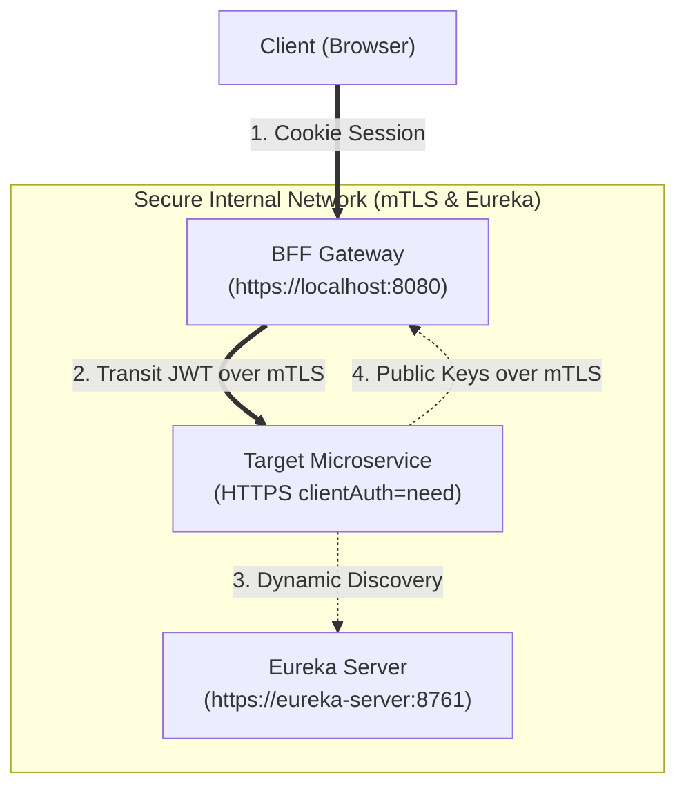

# 🌐 New Microservice Integration Guide

This guide describes how to create and integrate a new microservice (whether written in **Java (Spring Boot)**, **Python (FastAPI/Flask)**, or **Node.js (Express/NestJS)**) into the **Transcendence Zero-Trust Microservice Cluster**.

---

## 🏛️ Architecture Overview

Before writing code, it is important to understand the three pillars of security and communication in our network:



1. **Backend-For-Frontend (BFF) Gateway**: The client browser *only* talks to the Gateway (`https://localhost:8080`). The Gateway strips the stateful `SESSION` cookie, converts it into a signed **Transit JWT**, and forwards the request downstream as `Authorization: Bearer <transitJwt>`.
2. **Mutual TLS (mTLS)**: All service-to-service communication requires mTLS. Incoming requests are authenticated against our internal **Root CA**, and outgoing requests must present the service's certificate.
3. **Netflix Eureka Discovery**: Services do not hardcode downstream URLs. They register themselves securely with Eureka, and the Gateway routes traffic dynamically using `lb://<service-name>`.

---

## 📋 Integration Workflow Checklist

To add a new service named `my-service`, follow this workflow:

1. [ ] **Register Certificates**: Generate mTLS certificates for `my-service` using `./scripts/mtls-setup.sh`.
2. [ ] **Build the Service**: Write your application, configuring it to:
    - Listen on HTTPS and **require** client certificates (server-side mTLS).
    - Register with and send periodic heartbeats to Netflix Eureka.
    - Validate the Gateway's Transit JWT on incoming requests.
3. [ ] **Configure Gateway Route**: Define how the BFF Gateway routes paths (e.g. `/api/my-service/**`) to your service in `config/config-repo/gateway/gateway.yaml`.
4. [ ] **Orchestrate with Docker**: Define `my-service` in `docker/docker-compose.apps.yml` with network hooks, cert mounts, and an mTLS-secured health check.

---

## ⚡ Fast-Track Service Provisioning (CLI Tool)

For a fully automated integration process, you can use our unified registration CLI script from the root of the workspace. It duplicates the boilerplate template, configures mTLS certificates, injects Gateway routing rules, appends the container configuration to the Docker Compose manifest, and performs a live Gateway context refresh.

Run the following command:
```bash
./scripts/register-service.sh <service-name> <template-type>
```

* **`<service-name>`**: The lowercase name of your microservice (e.g., `billing-service`, `game-engine`).
* **`<template-type>`**: The stack template, either `nodejs` (Express) or `python` (FastAPI).

### What the Script Automates:
1. **Boilerplate Creation**: Copies the selected stack template to `services/<service-name>`.
2. **mTLS Generation**: Executes `mtls-setup.sh` to generate the secure service keys and certificates.
3. **Gateway Routing**: Appends a route mapping inside `config/config-repo/gateway/gateway.yaml` matching `/api/<route-prefix>/**`.
4. **Docker Orchestration**: Adds the complete container service block inside `docker/docker-compose.apps.yml` using correct SSL mounts and internal mTLS health checks.
5. **Zero-Downtime Hot Refresh**: Contacts the Gateway Actuator to reload properties from the Config Server and refresh the routing mappings live without a service reboot.

After running the script, simply build and start the container:
```bash
docker compose -f docker/docker-compose.apps.yml up -d --build <service-name>
```

---

## 🔑 Step 1: Certificate Registration (Manual)

Every service needs its own certificate signed by the Root CA to participate in the mTLS network.

Run the certificate manager script from the root of the project:
```bash
./scripts/mtls-setup.sh add my-service
```

This generates a certificate package in the `certs/services/my-service/` directory containing:
* `my-service.key`: Private RSA Key (Keep secure, permissions `600`)
* `my-service.crt`: Signed SSL Certificate (`644`)
* `my-service.pem`: Combined key + certificate (for Nginx/HAProxy)
* `my-service-chain.pem`: Combined cert + Root CA certificate
* `my-service.p12`: PKCS12 Keystore containing the chain (used by Java / Spring Boot)

Additionally, the global Root CA certificate is located at `certs/rootCA/rootCA.crt` and the shared Java truststore at `certs/truststore/truststore.p12`.

---

## 🛠️ Step 2: Service Templates

To accelerate integration, we have created complete, runnable boilerplate projects for both **Python** and **Node.js**:

* **Python (FastAPI)**: [templates/python-fastapi/](file:///home/laxuard/1337/Microservices/templates/python-fastapi/)
* **Node.js (Express)**: [templates/nodejs-express/](file:///home/laxuard/1337/Microservices/templates/nodejs-express/)

You can duplicate either directory into `services/my-service/` and customize it.

### 🔌 Framework Configurations

#### 1. Java (Spring Boot)
For Java developers, Spring Boot handles the infrastructure seamlessly. Ensure the following configurations are added to your config repository file (e.g., `config/config-repo/my-service/my-service.yaml`):

```yaml
server:
  port: 8443 # Standard internal container port
  ssl:
    enabled: true
    client-auth: need
    bundle: microservice-bundle # Defined globally in config-repo/application.yaml

eureka:
  client:
    service-url:
      defaultZone: https://eureka-server:8761/eureka/
  instance:
    secure-port-enabled: true
    non-secure-port-enabled: false
```

#### 2. Python (FastAPI / Uvicorn)
Configure the Uvicorn server to demand client certs:
```python
import ssl

uvicorn.run(
    "app:app",
    host="0.0.0.0",
    port=8443,
    ssl_keyfile="/app/certs/services/my-service/my-service.key",
    ssl_certfile="/app/certs/services/my-service/my-service.crt",
    ssl_ca_certs="/app/certs/rootCA/rootCA.crt",
    ssl_cert_reqs=ssl.CERT_REQUIRED  # Enforce mTLS client cert verification
)
```

#### 3. Node.js (Express)
Configure the Node `https` server:
```javascript
const https = require('https');
const fs = require('fs');

const options = {
    key: fs.readFileSync('/app/certs/services/my-service/my-service.key'),
    cert: fs.readFileSync('/app/certs/services/my-service/my-service.crt'),
    ca: fs.readFileSync('/app/certs/rootCA/rootCA.crt'),
    requestCert: true,          // Request client certificate
    rejectUnauthorized: true   // Verify client certificate matches Root CA
};

https.createServer(options, app).listen(8443);
```

---

## 📡 Step 3: Connecting to Netflix Eureka

Since non-Java services cannot use the Java-specific `spring-cloud-starter-netflix-eureka-client` library, they must interact directly with the **Eureka REST API**. 

Because Eureka is secured via mTLS, all REST calls must present the service's key/certificate and verify Eureka using the `rootCA.crt`.

### Eureka REST Endpoints
* **Register**: `POST https://eureka-server:8761/eureka/apps/{APP_NAME}`
* **Heartbeat**: `PUT https://eureka-server:8761/eureka/apps/{APP_NAME}/{INSTANCE_ID}`
* **Deregister**: `DELETE https://eureka-server:8761/eureka/apps/{APP_NAME}/{INSTANCE_ID}`

### Registration JSON Schema
You must explicitly declare the port as secure and mark the default port as disabled in the registration payload:

```json
{
  "instance": {
    "instanceId": "my-service:my-service:8443",
    "hostName": "my-service",
    "app": "MY-SERVICE",
    "ipAddr": "my-service",
    "status": "UP",
    "port": {
      "$": 8443,
      "@enabled": "false"
    },
    "securePort": {
      "$": 8443,
      "@enabled": "true"
    },
    "vipAddress": "my-service",
    "secureVipAddress": "my-service",
    "dataCenterInfo": {
      "@class": "com.netflix.appinfo.InstanceInfo$DefaultDataCenterInfo",
      "name": "MyOwn"
    }
  }
}
```

> [!WARNING]
> Heartbeats must be sent every **30 seconds**. If Eureka does not receive a heartbeat for 90 seconds, it will automatically evict the service, causing the Gateway to throw `503 Service Unavailable`. Refer to [eureka.py](file:///home/laxuard/1337/Microservices/templates/python-fastapi/eureka.py) or [eureka.js](file:///home/laxuard/1337/Microservices/templates/nodejs-express/eureka.js) for structured implementations of background heartbeat loops.

---

## 🔒 Step 4: Validating the Transit JWT

The BFF Gateway signs the Transit JWT using its private RSA key. Downstream services must validate this token before executing business logic.

### 1. Token Claims Structure
A valid Transit JWT contains the following payload claims:
```json
{
  "sub": "550e8400-e29b-41d4-a716-446655440000", // The User's UUID
  "iss": "transcendence-gateway",
  "iat": 1716912345,
  "exp": 1716912405, // Token expires in 60 seconds!
  "roles": ["USER", "ADMIN"],
  "sid": "redis-session-id-xyz", // Stateful session pointer
  "tid": "correlation-trace-id-abc" // Observability trace id
}
```

### 2. Validation Methods
Downstream services can validate the token signature in two ways:
* **Dynamic JWKS (Recommended for Prod)**: Fetch the Gateway's public keys from `https://gateway:8443/.well-known/jwks.json` over mTLS. Downstream services cache these keys (Cache-Control max-age is set to 24 hours).
* **Static Public Key (Recommended for Local Dev)**: Mount the Gateway's public key file `certs/jwt/jwt_public.pem` into the service and load it directly. This bypasses the need for outbound mTLS calls to the gateway.

> [!IMPORTANT]
> Because the transit window is extremely tight (`exp` is 60 seconds), your server's clock must be synchronized with the Gateway container's clock. If you experience clock drift in Docker, restart your Docker daemon.

---

## 🔀 Step 5: Gateway Route Configuration

To make your microservice accessible through the BFF Gateway, you need to append route configurations in the Gateway's configuration server.

1. Open `config/config-repo/gateway/gateway.yaml`.
2. Locate the `spring.cloud.gateway.routes` array and add a new route block:

```yaml
            # Route to my new custom service
            - id: my-service-route
              uri: lb://my-service # Discovered dynamically via Eureka registration ID
              predicates:
                - Path=/api/my-service/**
              filters:
                - StripPrefix=2 # Strips "/api/my-service" off the path (e.g. GET /api/my-service/hello -> GET /hello)
                - SessionToJwt # Translates cookie to bearer JWT
                - TwoFactorCheck # Optional: Blocks request if user hasn't completed MFA challenge
```

3. (Optional) To aggregate your service's OpenAPI docs in the central Gateway Swagger UI, add the documentation URL mapping under `springdoc.swagger-ui.urls`:
```yaml
springdoc:
  swagger-ui:
    urls:
      - name: "Authentication Service"
        url: "/api/auth/v3/api-docs"
      - name: "My Service"
        url: "/api/my-service/v3/api-docs"
```

---

## 🐳 Step 6: Docker Compose Integration

Once the code and route are configured, add the service definition to the applications compose manifest (`docker/docker-compose.apps.yml`):

```yaml
  my-service:
    build:
      context: ../services/my-service
      dockerfile: Dockerfile
    image: transcendence-my-service:latest
    container_name: my-service
    environment:
      - PORT=8443
      - SPRING_APPLICATION_NAME=my-service
      - EUREKA_URL=https://eureka-server:8761/eureka/
      - CERT_DIR_PATH=/app/certs
      - JWKS_URI=https://gateway:8443/.well-known/jwks.json
      - JWT_PUBLIC_KEY_PATH=/app/certs/jwt/jwt_public.pem
      - CERT_PASSWORD=${CERT_PASSWORD}
    volumes:
      - ../certs:/app/certs:ro # Read-only certificates mount
    healthcheck:
      # Use mTLS curl to monitor application health status
      test: [ "CMD", "curl", "-k", "--cert", "/app/certs/services/my-service/my-service.crt", "--key", "/app/certs/services/my-service/my-service.key", "-f", "https://localhost:8443/health" ]
      interval: 10s
      timeout: 5s
      retries: 5
      start_period: 10s
    depends_on:
      gateway:
        condition: service_healthy
      eureka-server:
        condition: service_healthy
    networks:
      - transcendence-net
```
